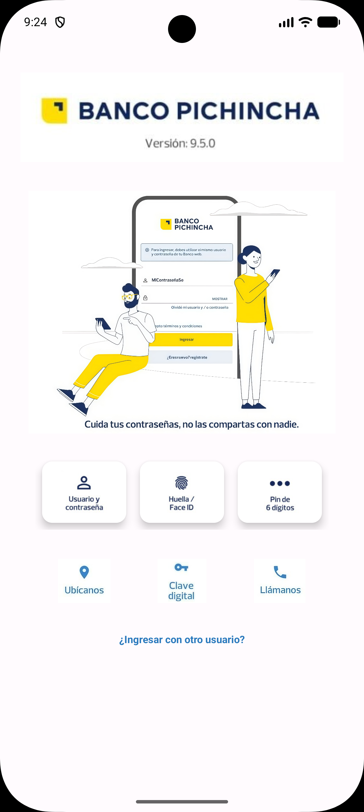

# BancoApp — Pantalla de Inicio de Sesión

Aplicación Android de banca móvil. Esta pantalla de inicio permite al usuario autenticarse mediante credenciales, huella digital o PIN, y acceder a opciones rápidas de contacto y seguridad.

---

## Capturas del diseño

| Pantalla principal |
|:------------------:|
|  |

```markdown

```

---

## Características

- **Logo e imagen de marca** en la parte superior
- **3 botones de autenticación** con ícono, borde y sombra:
  - Usuario y contraseña
  - Huella digital
  - PIN
- **3 accesos rápidos** sin borde ni sombra:
  - Ubícanos
  - Cambiar clave
  - Llámanos
- Enlace *¿Ingresar con otro usuario?*
- Diseño adaptable con `ConstraintLayout` y `EdgeToEdge`

---

## Tecnologías

| Item | Detalle |
|------|---------|
| Lenguaje | Java |
| SDK mínimo | API 33 (Android 13) |
| SDK objetivo | API 36 |
| Layout | ConstraintLayout + LinearLayout |
| Animaciones | Lottie |
| UI | Material Design / AppCompat |

---

## Estructura del proyecto

```
app/
├── src/main/
│   ├── java/com/example/bancoappp/
│   │   └── MainActivity.java
│   └── res/
│       ├── drawable/          # íconos y fondos de botones
│       ├── layout/
│       │   └── activity_main.xml
│       └── values/
screenshots/                   # capturas del diseño (agregar aquí)
```

---

## Cómo ejecutar

1. Clonar el repositorio:
   ```bash
   git clone https://github.com/BelindaTZ/BancoAppP.git
   ```
2. Abrir en **Android Studio**.
3. Sincronizar Gradle (`Sync Now`).
4. Ejecutar en emulador o dispositivo con Android 13+.

---

## Cómo agregar capturas al README

1. Corre la app en el emulador.
2. En la barra lateral del emulador haz clic en el ícono de **cámara** (o usa `Volumen − + Power` en dispositivo físico).
3. Guarda la imagen como `screenshots/main_screen.png`.
4. Haz commit:
   ```bash
   git add screenshots/
   git commit -m "Add app screenshots"
   ```

---

## Autor

**BelindaTZ** — [btoaquizaz@uteq.edu.ec](mailto:sleepislife2409@gmail.com)
